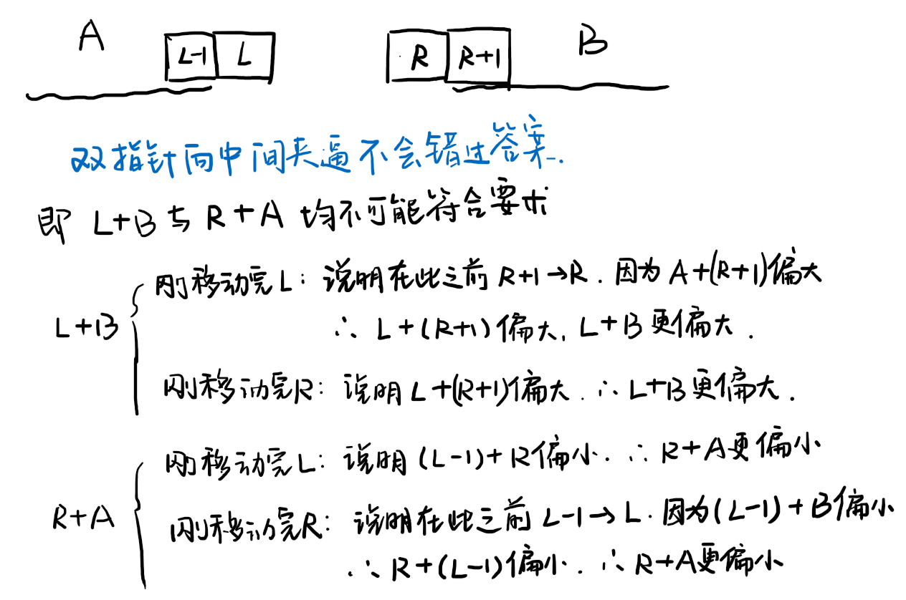

Given an array nums of n integers, are there elements a, b, c in nums such that a + b + c = 0? Find all unique triplets in the array which gives the sum of zero.

Note:

The solution set must not contain duplicate triplets.

Example:

Given array nums = [-1, 0, 1, 2, -1, -4],

A solution set is:
[
  [-1, 0, 1],
  [-1, -1, 2]
]

来源：力扣（LeetCode）
链接：https://leetcode-cn.com/problems/3sum
著作权归领扣网络所有。商业转载请联系官方授权，非商业转载请注明出处。

---

## 框架

```cpp
class Solution {
public:
    vector<vector<int>> threeSum(vector<int>& nums) {
      
    }
};
```

## 1. 朴素

遍历每个三元组，判断是否和为0即可，`O(n^3)`。
但是还得想办法避免重复。
使用 `set`作为初始的存储容器，每个符合条件的三元组在 `vector`中由小到大存放，最后把 `set`转储到 `vector`即可。
不过 `set`的 `insert()`是 `O(logm)`的，因此总的复杂度是 `O(n^3logm)`，`m`是 `set.size()`
**提交失败，超时了。**

```cpp
class Solution {
public:
    vector<vector<int>> threeSum(vector<int>& nums) {
        vector<vector<int>> ans;
        int n = nums.size();
        if(n < 3)
            return ans;
      
        set<vector<int>> st;
        for(int i = 0; i < n - 2; i++){
            for(int j = i + 1; j < n - 1; j++){
                for(int k = j + 1; k < n; k++){
                    if(nums[i] + nums[j] + nums[k] == 0){
                        vector<int> temp = {nums[i], nums[j], nums[k]};
                        sort(temp.begin(), temp.end());
                        st.insert(temp);
                    }
                }
            }
        }

        for(auto iter = st.begin(); iter != st.end(); ++iter)
            ans.push_back(*iter);
      
        return ans;
    }
};
```

## 2. 先处理两个，然后查找需要的一个

参考题目：*1. Two Sum*。
~~使用 `map<pair<int, int>>`，`key`为 `pair(ai, bi)`，`value`为 `0 - nums[ai] - nums[bi]`。~~
~~`key`记录索引而不是直接记录值是为了方便判断避免多次使用同一个数。~~
~~首先遍历 `a, b`，储存到 `map`中，`value`储存还需要的值。~~*问题是 `map[]`是 `O(m)`，所以应该是 `O(mn^2)`。*
~~然后遍历 `map`，判断当前的 `value`在 `nums`中是否存在，`O(mn)`，`m = map.size()`。~~
提交失败，超时。原因是没有考虑到 `map[]`并不是 `O(1)`而是 `O(m)`的。
*实际上，上述内容中，并不需要使用 `map`。*
对于 `1. Two Sum`，使用 `map/ unordered_map`是为了将查找的时间由 `O(n)`降低到 `O(1)/ O(logn)`。
而在此处，我们首先把两个的处理好了，然后再遍历它，搜索剩余的一个，所以此处 `map`是没必要的，反而会增加时间。
虽说 `map/ unordered_map`可以记录 `pair<int, int>`和相对应的需要的值，不过就算不记录 `value`，后面再算也是可以的。
因此这里需要的只是一个对于插入是 `O(1)`的数据结构，可以选择 `vector/ list/ set/ unordered_map`等。
这里选择 `list`，仍然是先记录索引。
*不过提交仍然超时，原因是错估了 `list.size()`的大小，它实际上能到达 `O(n^2)`*

```cpp
class Solution {
public:
    vector<vector<int>> threeSum(vector<int>& nums) {
        vector<vector<int>> ans;
        int n = nums.size();
        if(n < 3)       //判断特殊情况
            return ans;
      
        list<pair<int, int>> ls;    //预处理，O(n^2)
        for(int i = 0; i < n - 1; i++)
            for(int j = i + 1; j < n; j++)
                ls.push_back(pair(i, j));
        //这里产生的ls中元素个数大约是O(n^2)的，而不是预想的m < n个，因此导致超时。

        set<vector<int>> st;
        //应该是这里的问题，ls中有(n-1)+(n-2)+...+1 = O(n^2)个，我以为是O(m)个，m<n，但是实际上m是约等于n^2的。
        //因此对于每一个ls中的元素，又得去nums中找n个元素，所以总计仍然是O(n^3)的。
        for(auto iter = ls.begin(); iter != ls.end(); ++iter){
            for(int i = 0; i < n; i++){
                if(i != iter->first && i != iter->second && nums[iter->first] + nums[iter->second] + nums[i] == 0){
                    vector<int> vec = {nums[iter->first], nums[iter->second], nums[i]};
                    sort(vec.begin(), vec.end());   //vector中3个数由小到大，通过set去重
                    st.insert(vec);
                    break;
                }
            }
        }
      
        for(auto iter = st.begin(); iter != st.end(); ++iter)
            ans.push_back(*iter);
      
        return ans;
    }
};
```

## 3. 完全类似Two Sum，先确定一个元素，然后按照Two Sum来做，相当于n次Two Sum.

fix 1个元素是 `O(n)`，然后Two Sum如果使用hash表（`unordered_map`)则为 `O(n)`，总计 `O(n^2)`。
仍然是需要 `set`去重。
不过提交还是失败了，~~不知道为什么会超时，明明是 `O(n^2)`的。~~
*知道了，它不是 `O(n^2)`的，而是 `O(n^2logm)`的，而且最坏是 `O(n^2logn)`的，比如题目卡的极端情况 `0,0,0,...,0`。*
*利用 `set`去重是有时间损失的，因为 `set`内部靠红黑树建立有序关系，`set.insert()`是 `O(logn)`的。*

```cpp
class Solution {
public:
    vector<vector<int>> threeSum(vector<int>& nums) {
        vector<vector<int>> ans;
        int n = nums.size();
        if(n < 3)
            return ans;
      
        set<vector<int>> st;
        for(int i = 0; i < n; i++){
            unordered_map<int, int> mp;
            for(int j = 0; j < n; j++){
                if(i == j)
                    continue;
                if(mp.count(nums[j])){
                    vector<int> vec = {nums[i], nums[j], nums[mp[nums[j]]]};
                    sort(vec.begin(), vec.end());
                    st.insert(vec);
                }else
                    mp[0 - nums[i] - nums[j]] = j;
            }
        }

        for(auto iter = st.begin(); iter != st.end(); ++iter)
            ans.push_back(*iter);
      
        return ans;
    }
};
```

## 4. 排序+双指针+剪枝

**排序**：为了便于之后查找和为0的元素，并且便于去重。且 `O(nlogn)`的时间复杂度对于大概 `O(n^2)`的这道题来说不算什么。
**双指针**：首先确定一个元素，然后利用双指针在其右侧查找满足和为0的元素。
**剪枝**：由于是有序的，所以为了实现 `a+b+c=0`，则最小的 `a`必须满足 `a<0`，如果到了 `a>0`，可以直接剪枝结束了。

思路是：

1. 首先由小到大排序，`O(nlogn)`。
2. 遍历fix每个元素作为 `a`，然后从该元素右侧的区间中寻找满足 `a + b + c = 0`的元素 `b`和 `c`。
3. 查找方法是设置双指针 `left = i + 1`, `right = n - 1`，然后二者向中心靠拢直至碰撞。当等式左侧结果大于0时，`right--`；当等式左侧结果小于0时，`left++`；等于0时，记录，并 `left++, right--`。
4. 由于寻找 `b, c`是从 `a`的右侧寻找，且已经将数组由小到大排列，因此当 `a>0`时就可剪枝结束遍历。
5. 上述方法还需要进行去重。并不是选择和上述方法相同的利用 `set`去重（因为 `set`去重有时间损失，`O(logn)`），而是在寻找 `a, b, c`时直接去重。方法是当出现相等的元素时，先处理第一个元素然后再跳过后面的相等的，而不能跳过前面相等的只处理最后一个，比如 `-1, -1, 0, 1, 2`。

[参考链接](https://github.com/grandyang/leetcode/issues/15)

**这个解法的聪明之处：**

1. 用仅仅 `O(nlogn)`的时间进行了排序，方便了之后的去重和双指针的查找操作。
2. 并不是fix一个元素然后完全仿照 `2. Two Sum`，因为后者不需要去重。
3. 不使用 `set`去重，因为 `set.insert()`有 `O(logn)`的时间损失，而是在有序的基础上先匹配，后跳过。
4. 使用双指针。因为已经是有序的了，所以利用双指针从两侧夹逼(`11. Container With Most Water`)就可以固定到 `left`和 `right`。
5. 双指针的移动为什么偏小就 `left++`，偏大就 `right--`，参考下图：

**`1. Two Sum` 与 `15. 3Sum` 的区别**

1. `two sum`使用的是 `hash表`，遍历一次数组 `O(n)`就可以解决问题。
2. `3sum`很类似于先fix一个元素，然后对右侧元素进行 `two sum`。
3. 不过问题在于，`two sum`是没有重复值的，`3sum`有重复值并且需要去重。
4. 如果后期用 `set`去重，则会额外有 `O(logn)`的时间损失。
5. 如果还是使用 `two sum`并且在前期去重，则需要记录已经得到的数据组，需要额外的 `unordered_map<pair<int, int>, bool>`，非常浪费空间。
6. 所以 `3sum`采用的方法是双指针，并且从两侧夹逼，毕竟已经是有序数组了。
7. `two sum`也可以使用双指针，但是毕竟它不需要去重，并且利用 `hash表`已经到达 `O(n)`的复杂度了，再排序 `O(nlogn)`利用双指针就有些多余了。

```cpp
class Solution {
public:
    vector<vector<int>> threeSum(vector<int>& nums) {
        int n = nums.size();
        vector<vector<int>> ans;
        if (n < 3)
            return ans;
      
        sort(nums.begin(), nums.end());     //sort
        for (int i = 0; i < n - 2; i++) {
            if (nums[i] > 0)    //pruning
                break;
          
            while (i < n - 2 && i > 0 && nums[i] == nums[i - 1]) //skip repeated values
                i++;
          
            int left = i + 1, right = n - 1;
            while (left < right) {
                if (nums[i] + nums[left] + nums[right] == 0) {
                    ans.push_back(vector<int>{nums[i], nums[left], nums[right]});
                    left++;
                    right--;
                } else if (nums[i] + nums[left] + nums[right] < 0)
                    left++;
                else
                    right--;
              
                //skip repeated values
                while (left < right && left > i + 1 && nums[left] == nums[left - 1])
                    left++;
                while (left < right && right < n - 1 && nums[right] == nums[right + 1])
                    right--;
            }
        }

        return ans;
    }
};
```
