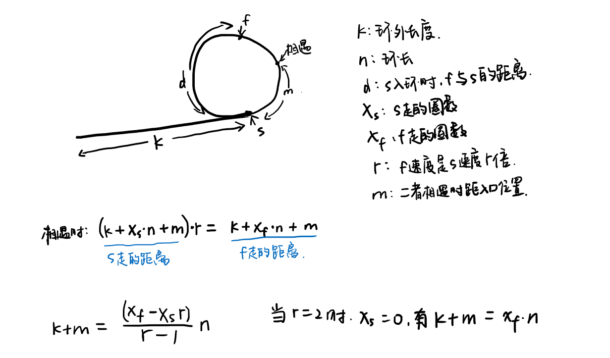

首先可以得到的结论是：

**只要快慢指针从同一起点出发，则一定能相遇（从起点出发，在环长度的倍数倍位置上一定能相遇，不论快慢指针步长如何。但首次相遇位置不一定在此处），并且当快指针速度是慢指针的整数倍时，相遇时慢指针在圆环中移动的距离不足一周。**

原因是，设圆环外链表长度为k，圆环长度为n，快指针速度是慢指针的r倍。

先考虑r为整数的情况：

令慢指针前进S（S为n的倍数，并且满足k<=S<k+n）距离，保证慢指针能够位移进入圆环，此时，快指针移动的距离为rS，可以看作先前进了S到达慢指针前进S到达的地点，又前进了(r-1)S，这部分为n的倍数，相当于转圈。因此便证明了上述结论。

考虑r为小数的情况：
 此时上述提到的快指针移动的距离rS不一定为整数，为保证rS为整数，需要增大S，而增大S便会导致S>=k+n，所以慢指针在圆环中移动的距离会超过一周。

S处考虑的只是一定能相遇的情况，而在慢指针前进不足S时，也有可能相遇，比如slow = 1, fast = 5, k = 1, n = 4，快慢指针位移一次即可相遇。

**除了判断环形链表，快慢指针还能干什么？**

1. 找链表的中点。
2. 求环形链表的长度。
3. 找环形链表的开头。

因为已经得到了必定相遇的结论，因此以下使用慢指针=1，快指针=2的步长。

由上图可以得知，k+m是环长n的整数倍，因此从相遇点继续前进k长的距离就会到达圆环入口。

所以可以另设一个新的指针从链表头出发，以1的速度与慢指针同步前进，二者相遇的位置即为入口。

至于环的长度，保持快指针不动，慢指针走至重新重合即可获得长度。
