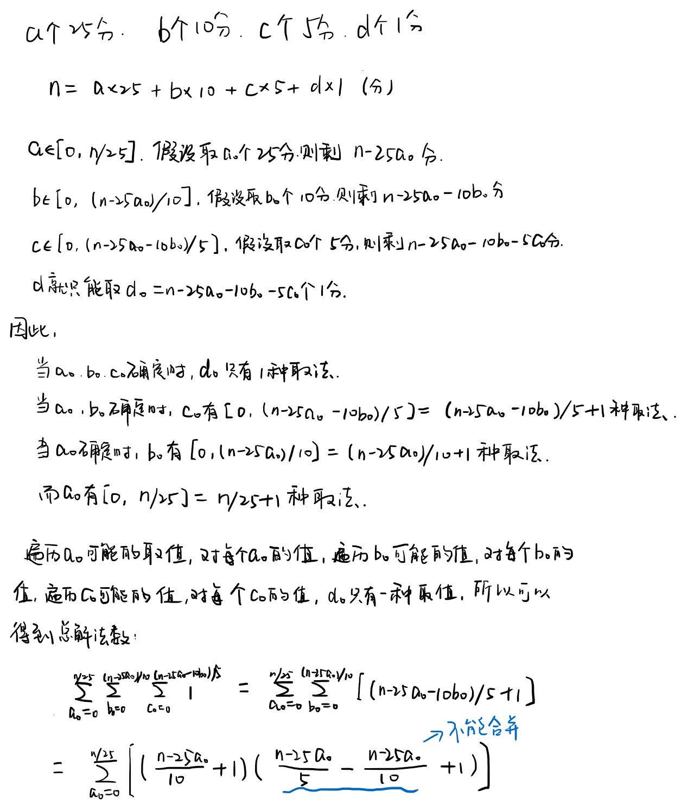

## 1. 数学方法
时间`O(n)`，空间`O(1)`，不过要是能继续把公式往下推的话，可能会有时间`O(1)`吧。  
  
```cpp
class Solution {
public:
    int waysToChange(int n) {
        int ans = 0;
        for (int i = 0; i <= n / 25; i++) {
            int temp = n - 25 * i;
            ans = (ans + (long long)(temp / 10 + 1) * (temp / 5 - temp / 10 + 1) % 1000000007) % 1000000007;
        }
        return ans;
    }
};
```

## 2. 完全背包的方案数
背包容量：n  
物品价值：1, 5, 10, 25  
物品体积：1, 5, 10, 25  
要求恰好装满容量为n的背包，并求解方案数。  
用完全背包：时间`O(NV) = O(4*n) = O(n)`，空间`O(n)`  

如果是求恰好装满的最大价值，则是普通的完全背包问题。  
初始化`dp[i] = -INF; dp[0] = 0`  
转移是`dp[i] = max(dp[i], dp[i - w[i]] + v[i])`  

而现在是求恰好装满的方案数，是一个变种的完全背包问题。  
初始化`dp[i] = 0`，代表初始时没有方案可以满足完全装满容量为i的背包。  
初始化`dp[0] = 1`，代表容量为0的背包恰好装满有1种方案。  
转移是`dp[i] = dp[i] + dp[i - w[i]]`，代表容量为i的背包恰好装满取决于上一次（只看前部分的物品）装满容量为i的背包的方案数（不装当前物品）+上一次装满容量为`i-w[i]`的背包的方案数（装上当前物品）。  
```cpp
class Solution {
public:
    int waysToChange(int n) {
        int* dp = new int[n + 1]{0};
        dp[0] = 1;
        int coins[4] = {1, 5, 10, 25};

        for (int i = 0; i < 4; i++) 
            for (int j = coins[i]; j <= n; j++) 
                dp[j] = (dp[j] + dp[j - coins[i]]) % 1000000007;

        int ans = dp[n];
        delete []dp;
        return ans;
    }
};
```