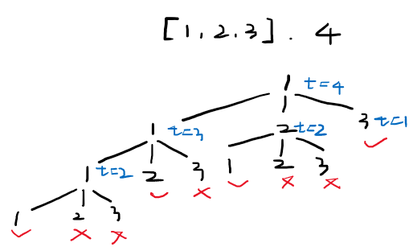

## 前言

这道题目跟“39.组合总和”是一样的，都是无重复数组，可重复选择。
区别是39题返回的是全部的组合（数组），而这道题是仅返回组合数目。
所以39题需要使用递归和回溯，在此过程中记录满足要求的组合到数组中；而由于递归过程中出现了许多重复计算，并且在这道题中仅要求组合的数目，不需要组合，因此使用记忆化去掉重复计算。

## 1. 递归+回溯

可以重复选择，并且考虑顺序，因此在递归时全部从头重新选择。
超时。

```cpp
class Solution {
public:
    int combinationSum4(vector<int>& nums, int target) {
        ans = 0;
        sort(nums.begin(), nums.end());
        dfs(nums, target);

        return ans;
    }
private:
    void dfs(vector<int>& nums, int target) {
        if (target == 0) {
            ans++;
            return;
        } else if (target < 0)
            return;
      
        int n = nums.size();
        for (int i = 0; i < n; i++) {
            if (target < nums[i])
                break;
            dfs(nums, target - nums[i]);
        }
    }
    int ans;
};
```

## 2. dp

通过下图可以看到，重复的选择非常多。

虽然之前回溯做过的组合总和题目中，也有重复选择，但是由于之前的题目都是在下次递归时会将数组的索引向前推进一个，所以不会有太多的重复选择。
所以此处做一个记忆化，可以使用 `dp[i]`记录target为i的组合答案。
`dp[i] = sum(dp[i - nums[j]])`
时间 `O(kn)`，空间 `O(k)`

```cpp
class Solution {
public:
    int combinationSum4(vector<int>& nums, int target) {
        int n = nums.size();
        vector<int> dp(target + 1, 0);
        dp[0] = 1;

        for (int i = 1; i <= target; i++) 
            for (int j = 0; j < n; j++)
                if (i - nums[j] >= 0)
                    dp[i] += dp[i - nums[j]];   // overflow!
      
        return dp[target];
    }
};
```

上面这种算法计算了1到target的每个取值的组合数。
对于 `[3, 33, 333], 10000`这组数据来说，求解target为9999时溢出极为严重（long long都不能cover），并且实际上target为10000是组合数为0.
所以可以改为递归计算，从 `dp[target]`开始，需要什么就通过递归计算其值。
需要注意的是，递归更可能出现重复，比如dp[10]=0，后面还会多次重复计算dp[10]的值，所以可以考虑把已经计算过的仍为0的结果置为-1，代表已经计算过，不需要重复计算。

```cpp
class Solution {
public:
    int combinationSum4(vector<int>& nums, int target) {
        int n = nums.size();
        vector<int> count(target + 1, 0);
        count[0] = 1;

        return dp(nums, count, target);
    }
private:
    int dp(vector<int>& nums, vector<int>& count, int k) {
        if (count[k] == 0) {
            for (int i = 0; i < nums.size(); i++)
                if (k >= nums[i])
                    count[k] += dp(nums, count, k - nums[i]);
        }
        if (count[k] == 0) 
            count[k] = -1;
      
        if (count[k] == -1)
            return 0;
        return count[k];
    }
};
```
