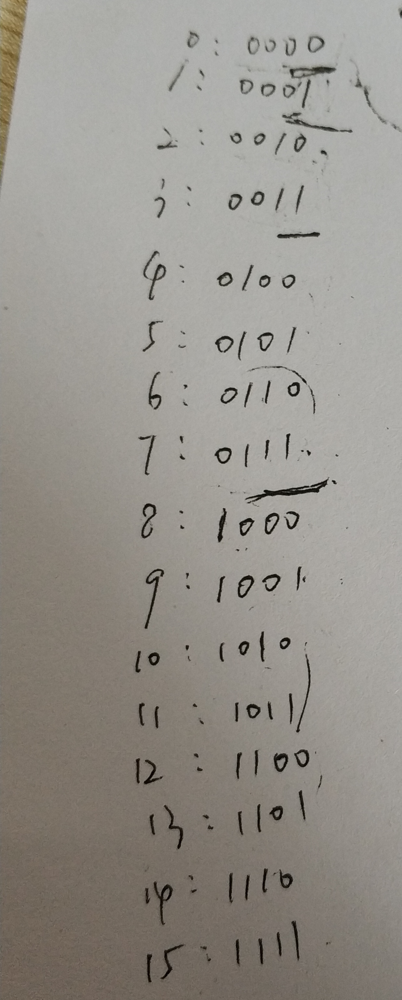

## 1. 分区间动态规划

通过观察一段连续数字的二进制可以发现，`[2^i, 2^(i+1))`部分实际是在之前的二进制数字前面加一位1.


所以可以根据 `2^i`分成多部分，根据已有的+1得到新的。
时间 `O(n)`，空间 `O(1)`。

```cpp
class Solution {
public:
    vector<int> countBits(int num) {
        vector<int> res(1, 0);

        for (int k = 0; ; k++) {
            int sz = pow(2, k);
            for (int i = 0; i < sz; i++) {
                if (sz + i > num)
                    break;
                res.push_back(1 + res[i]);
            }
            if (res.size() == num + 1)
                break;
        }

        return res;
    }
};
```

## 2. 奇偶动态规划

已有的数据在+1之后，二进制中1的位数可能发生改变。
但仔细考虑奇偶性，如果是奇数，则其中1的个数是比他小的偶数中1的个数+1；如果是偶数，则其中1的个数与该偶数除以二得到的数据中1的个数相等，因为相当于右移了1位0.
时间 `O(n)`，空间 `O(1)`。

```cpp
class Solution {
public:
    vector<int> countBits(int num) {
        vector<int> res(1, 0);
        for (int i = 1; i <= num; i++) {
            if (i % 2 == 1)
                res.push_back(res[i - 1] + 1);
            else 
                res.push_back(res[i >> 1]);
        }

        return res;
    }
};
```
