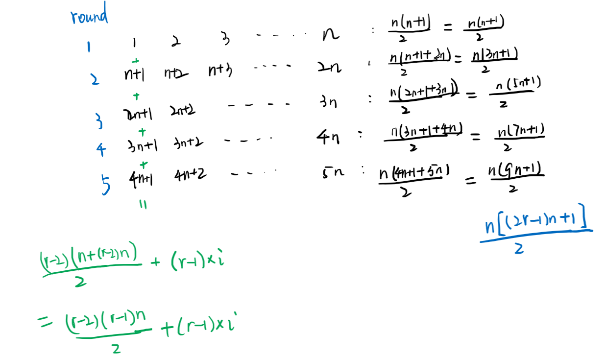

We distribute some number of candies, to a row of n = num_people people in the following way:

We then give 1 candy to the first person, 2 candies to the second person, and so on until we give n candies to the last person.

Then, we go back to the start of the row, giving n + 1 candies to the first person, n + 2 candies to the second person, and so on until we give 2 * n candies to the last person.

This process repeats (with us giving one more candy each time, and moving to the start of the row after we reach the end) until we run out of candies.  The last person will receive all of our remaining candies (not necessarily one more than the previous gift).

Return an array (of length num_people and sum candies) that represents the final distribution of candies.

 

Example 1:

Input: candies = 7, num_people = 4
Output: [1,2,3,1]
Explanation:
On the first turn, ans[0] += 1, and the array is [1,0,0,0].
On the second turn, ans[1] += 2, and the array is [1,2,0,0].
On the third turn, ans[2] += 3, and the array is [1,2,3,0].
On the fourth turn, ans[3] += 1 (because there is only one candy left), and the final array is [1,2,3,1].
Example 2:

Input: candies = 10, num_people = 3
Output: [5,2,3]
Explanation:
On the first turn, ans[0] += 1, and the array is [1,0,0].
On the second turn, ans[1] += 2, and the array is [1,2,0].
On the third turn, ans[2] += 3, and the array is [1,2,3].
On the fourth turn, ans[0] += 4, and the final array is [5,2,3].

Constraints:

1 <= candies <= 10^9
1 <= num_people <= 1000

来源：力扣（LeetCode）
链接：https://leetcode-cn.com/problems/distribute-candies-to-people
著作权归领扣网络所有。商业转载请联系官方授权，非商业转载请注明出处。

---

## 框架

```cpp
class Solution {
public:
    vector<int> distributeCandies(int candies, int num_people) {

    }
};
```

## 1. 直接推导


此处我的推导是以“轮”为单位，看能够发多少轮，不过确定多少轮还是用的减一下减一下的方法，复杂度是 `O(sqrt(C)/N + N)`。
**而复杂度更低的方法是以“次”为单位，一人发一次算一“次”，看看能发多少次，这样可以直接解出到底是发了多少次来，复杂度是 `O(N)`。**

```cpp
class Solution {
public:
    vector<int> distributeCandies(int candies, int num_people) {
        int round = 1;
        vector<int> alloc(num_people);

        while (candies >= num_people * ((2 * round - 1) * num_people + 1) / 2) {
            candies -= num_people * ((2 * round - 1) * num_people + 1) / 2;
            round++;
        }

        for (int i = 0; i < num_people; i++) {
            alloc[i] = (round - 2) * (round - 1) * num_people / 2 + (round - 1) * (i + 1);
            if (candies >= (round - 1) * num_people + i + 1) {
                alloc[i] += (round - 1) * num_people + i + 1;
                candies -= (round - 1) * num_people + i + 1;
            } else {
                alloc[i] += candies;
                candies = 0;
            }
        }

        return alloc;
    }
};
```
