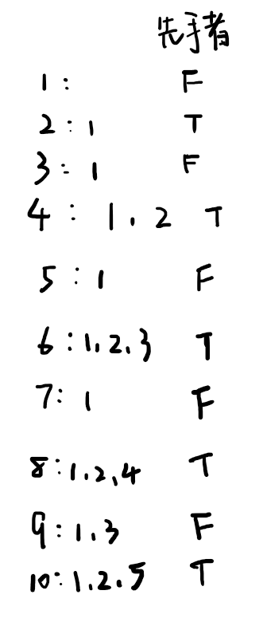

## 1. dp

设 `dp[i]`为 `N = i`时Alice的胜负情况，则 `dp[i]`取决于 `i`的 `[1, i - 1]`范围内的因数。

时间 `O(n^2)`，遍历 `1~n`是 `O(n)`，对每个数求因数又是 `O(n)`。空间复杂度 `O(n)`。

```cpp
class Solution {
public:
    bool divisorGame(int N) {
        vector<bool> dp(N + 1, false);
        for (int i = 2; i <= N; i++) {
            for (int j = 1; j < i; j++) {
                if (i % j == 0 && dp[i - j] == false) {
                    dp[i] = true;
                    break;
                }
            }
        }
        return dp[N];
    }
};
```

## 2. 博弈数学

初始时只有 `dp[1] = false`和 `dp[2] = true`.
考虑对于之后的奇数节点，由于奇数的因数必为奇数，所以 `dp[奇数]`必转移到 `dp[偶数]`.
而偶数的因数必有一个1，所以可以转移到前一个奇数，而奇数目前(`dp[1]`)是必败的，所以偶数选1使对方必败，自己则必胜。
因此 `dp[偶数]`是必胜的，`dp[奇数]`被迫转移到偶数之后也必败。
所以只需要判断奇偶性即可，时间空间复杂度均为 `O(1)`.

```cpp
class Solution {
public:
    bool divisorGame(int N) {
        return N % 2 == 0 ? true : false;
    }
};
```
