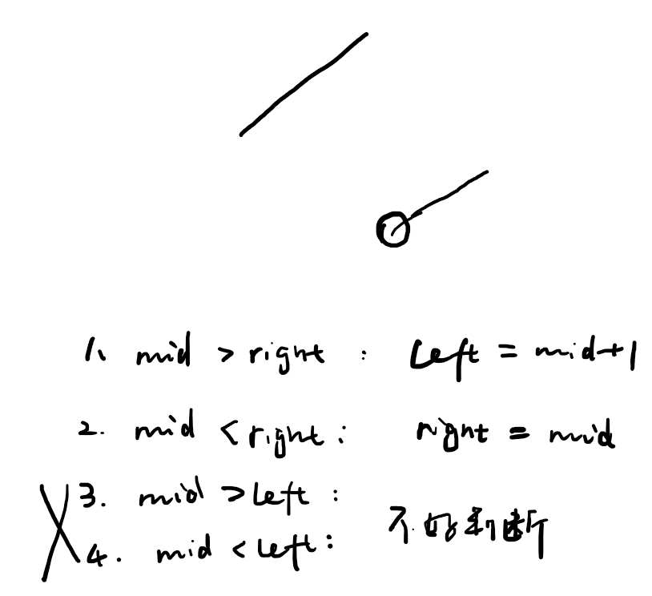

## 1. 朴素

`O(n)`扫描一遍。

## 2. 二分

判断mid和右节点right。
不判断mid和左节点left的原因是不方便判断，而且已经判断了right也没必要再去根据left判断了。


```cpp
class Solution {
public:
    int findMin(vector<int>& nums) {
        int n = nums.size();
        int l = 0, r = n - 1;
        while (l < r) {
            int mid = (r - l) / 2 + l;
            if (nums[mid] > nums[r])
                l = mid + 1;
            else if (nums[mid] < nums[r])
                r = mid;
        }

        return nums[l];
    }
};
```
