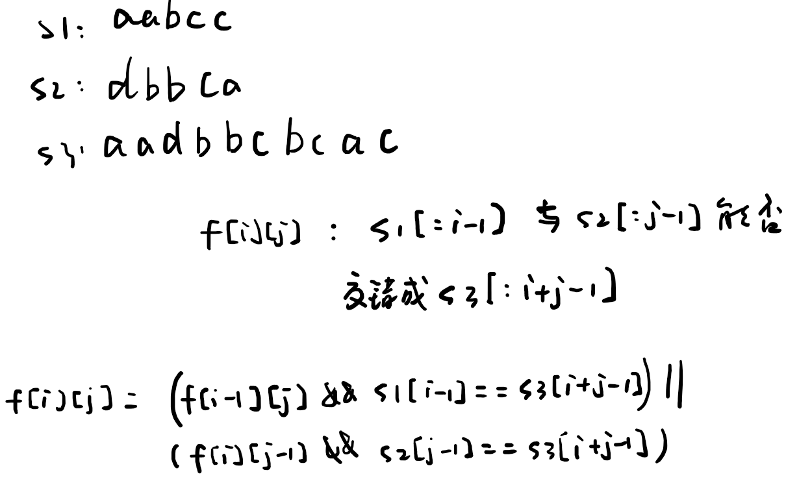

## 1. 递归

第一反应是双指针，s3判断一个，对应的s1或者s2向后移一位。
但问题在于，当s1和s2的当前位相同时，无法确定s1/s2向后移位。
如果加上回溯，则跟递归类似。
复杂度指数级。
可以通过记忆化降低复杂度。

```cpp
class Solution {
public:
    bool isInterleave(string s1, string s2, string s3) {
        int m = s1.length(), n = s2.length();
        if (m + n != s3.length())
            return false;
      
        if (m == 0 && n == 0)
            return true;
        else if (m == 0) {
            if (s2[0] == s3[0])
                return isInterleave(s1, s2.substr(1), s3.substr(1));
            else
                return false;
        } else if (n == 0) {
            if (s1[0] == s3[0])
                return isInterleave(s1.substr(1), s2, s3.substr(1));
            else
                return false;
        } else {
            if (s1[0] == s3[0] && s2[0] != s3[0])
                return isInterleave(s1.substr(1), s2, s3.substr(1));
            else if (s1[0] != s3[0] && s2[0] == s3[0])
                return isInterleave(s1, s2.substr(1), s3.substr(1));
            else if (s1[0] == s3[0] && s2[0] == s3[0])
                return isInterleave(s1.substr(1), s2, s3.substr(1)) || isInterleave(s1, s2.substr(1), s3.substr(1));
            else
                return false;
        }
    }
};
```

## 2. 动态规划

`f[i][j]`代表s1的前i个字符和s2的前j个字符是否符合s3的前i+j个字符。

时间复杂度：`O(mn)`
空间复杂度：`O(mn)`，但是因为更新只需要上一行，所以可以优化到 `O(n)`的空间

```cpp
class Solution {
public:
    bool isInterleave(string s1, string s2, string s3) {
        int m = s1.length(), n = s2.length();
        if (m + n != s3.length())
            return false;
      
        // vector<bool> 不是bool类型的数组，而是特殊的vector。
        // 内部可能使用1bit代表一个bool，参照http://www.cplusplus.com/reference/vector/vector-bool/
        vector<bool> dp(n + 1, false);
        dp[0] = true;
      
        for (int i = 0; i <= m; i++) {
            for (int j = 0; j <= n; j++) {
                if (i > 0)
                    dp[j] = dp[j] && s1[i - 1] == s3[i + j - 1];
                if (j > 0)
                    dp[j] = dp[j] || (dp[j - 1] && s2[j - 1] == s3[i + j - 1]);
            }
        }
      
        return dp[n];
    }
};
```
