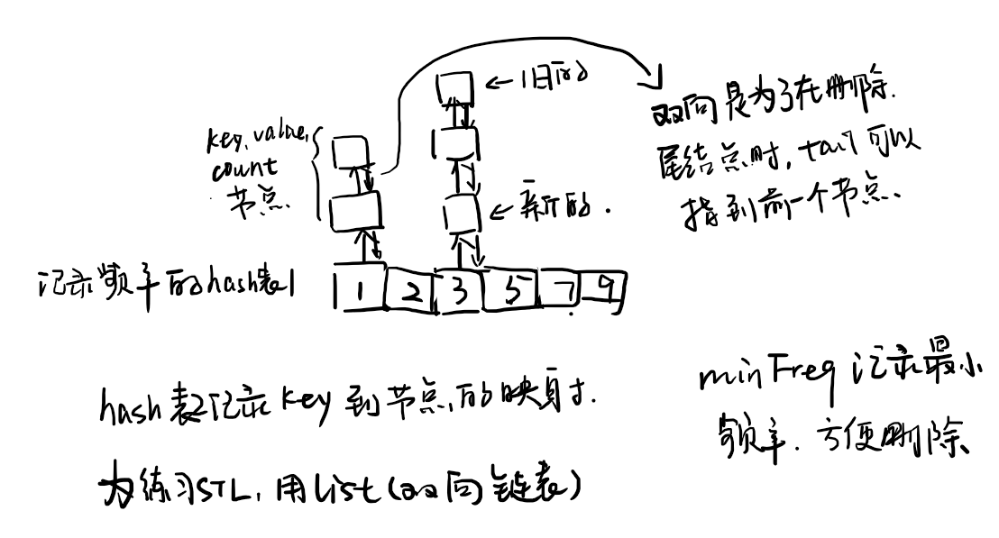

## 框架

```cpp
class LFUCache {
public:
    LFUCache(int capacity) {

    }
  
    int get(int key) {

    }
  
    void put(int key, int value) {

    }
};

/**
 * Your LFUCache object will be instantiated and called as such:
 * LFUCache* obj = new LFUCache(capacity);
 * int param_1 = obj->get(key);
 * obj->put(key,value);
 */
```

## 1. 模拟



```cpp
struct node {
    node (int k = 0, int v = 0, int f = 0) {
        key = k;
        value = v;
        freq = f;
    }

    int key;
    int value;
    int freq;
};

class LFUCache {
public:
    LFUCache(int capacity) {
        key_table.clear();
        freq_table.clear();
        this->capacity = capacity;
        minFreq = 0;
    }
  
    int get(int key) {
        if (key_table.count(key) == 0)
            return -1;
      
        int val = key_table[key]->value, freq = ++(key_table[key]->freq);
        freq_table[freq].push_front(*(key_table[key]));
        freq_table[freq - 1].erase(key_table[key]);
        if (freq_table[freq - 1].empty()) {
            // freq_table.erase(freq - 1);
            if (minFreq == freq - 1)
                minFreq = freq;
        }
        key_table[key] = freq_table[freq].begin();

        return val;
    }
  
    void put(int key, int value) {
        if (capacity == 0)
            return;

        if (key_table.count(key) == 1) {
            if (get(key) != value)
                key_table[key]->value = value;
        } else {
            if (key_table.size() == capacity) {
                key_table.erase(freq_table[minFreq].back().key);
                freq_table[minFreq].pop_back();
                // if (freq_table[minFreq].empty())
                    // freq_table.erase(minFreq);
            }
            freq_table[1].push_front(node(key, value, 1));
            key_table[key] = freq_table[1].begin();
            minFreq = 1;
        }
    }
private:
    unordered_map<int, list<node>::iterator> key_table;
    unordered_map<int, list<node> > freq_table;
    int minFreq;
    int capacity;
};

/**
 * Your LFUCache object will be instantiated and called as such:
 * LFUCache* obj = new LFUCache(capacity);
 * int param_1 = obj->get(key);
 * obj->put(key,value);
 */
```
