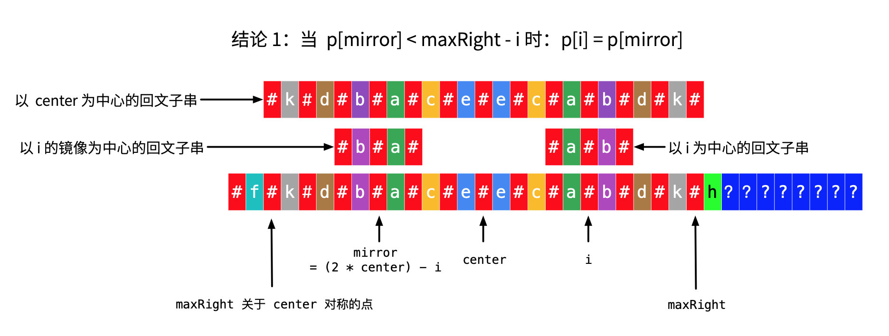
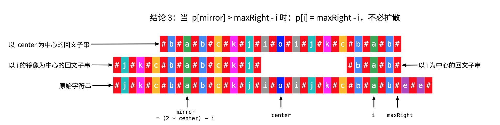

Given a string s, find the longest palindromic substring in s. You may assume that the maximum length of s is 1000.

Example 1:

Input: "babad"
Output: "bab"
Note: "aba" is also a valid answer.
Example 2:

Input: "cbbd"
Output: "bb"

来源：力扣（LeetCode）
链接：https://leetcode-cn.com/problems/longest-palindromic-substring
著作权归领扣网络所有。商业转载请联系官方授权，非商业转载请注明出处。

---

## 框架

```cpp
class Solution {
public:
    string longestPalindrome(string s) {
      
    }
};
```

## 1. 朴素

遍历每个子串 `O(n^2)`，判断子串是否回文 `O(n)`，共 `O(n^3)`
提交错误，*超时*。

```cpp
class Solution {
public:
    bool isPalindromic(string s) {
        int length = s.size();
        int mid = length / 2;
        for (int i = 0; i < mid; i++)
            if (s[i] != s[length - i - 1])
                return false;
        return true;
    }

    string longestPalindrome(string s) {
        int length = s.size();
        if (length == 1)    //exclusive
            return s;
      
        string ans = "";
        for (int i = 0; i < length - 1; i++){
            for (int j = i; j < length; j++) {
                string subs = s.substr(i, j - i + 1);
                if (isPalindromic(subs))
                    ans = subs.size() > ans.size() ? subs : ans;
            }
        }

        return ans;
    }
};
```

## 2. 最长公共子串

回文字符串正反都是一样的，所以对于回文字符串，其在 `s`和逆序的 `s'`中是一样的，因此可以转换为求 `最长公共子串`的问题。
注意 `最长公共子串`和 `最长公共子序列`是不同的，参考[https://blog.csdn.net/ggdhs/article/details/90713154](https://blog.csdn.net/ggdhs/article/details/90713154)
**最长公共子串不一定是 `s`的回文字符串，比如 `abc123cba`得到的最长公共子串是 `abc`但并不回文，因此还需要判断索引位置**

**最长公共子串**：其要求必须连续，所以dp时需要确定结尾元素相同，要不然接不上。设 `dp[i][j]`为数组 `A`中前 `i`个元素和数组 `B`中前 `j`个元素以 `A[i-1]`和 `B[j-1]`为结尾的最长公共子串的长度。则递推公式为：

1. `dp[i][j] = 0`, 当 `i = 0 || j = 0`时（初始条件）
2. `dp[i][j] = 0`, 当 `A[i-1] != B[j-1]`时（结尾不同，不能往后接了）
3. `dp[i][j] = dp[i-1][j-1] + 1`, 当 `A[i-1] == B[j-1]`时（可以继续往后接，顺便带上前面部分的长度）

所以初始化 `dp[m][n]`全为 `0`，仅当满足 `条件3`时更新值即可。此时的时间复杂度和空间复杂度均为 `O(mn)`。
值得注意的是，由于每次更新 `dp[i][j]`只需要 `dp[i-1][j-1]`，所以可以优化空间复杂度为 `O(n)`，不过此时需要记录最大值 `maxLength`，否则会被后面的值覆盖掉。同时也需要 `逆序`更新。

```cpp
class Solution {
public:
    string longestPalindrome(string s) {
        if (s == "")
            return s;
      
        string revs = s;
        int n = s.size();
        for (int i = 0; i < n / 2; i++){
            char temp = revs[i];
            revs[i] = revs[n - i - 1];
            revs[n - i - 1] = temp;
        }

        //int dp[n + 1];
        int *dp = new int[n + 1];
        for (int i = 0; i <= n; i++)
            dp[i] = 0;
        int maxLength = 0;
        int maxEnd = 0;

        for (int i = 1; i <= n; i++){
            for (int j = n; j > 0; j--){
                if (s[i - 1] == revs[j - 1]){
                    dp[j] = dp[j - 1] + 1;
                    if(dp[j] > maxLength && i + j == n + dp[j]){
                        maxLength = dp[j];
                        maxEnd = i - 1;
                    }
                }else
                    dp[j] = 0;
           }
        }
      
        delete []dp;
        return s.substr(maxEnd - maxLength + 1, maxLength);
    }
};
```

## 3. dp优化的朴素算法

遍历每个字符串是 `O(n^2)`，判断每个子串是否回文是 `O(n)`，因此朴素方法的复杂度是 `O(n^3)`.
朴素方法复杂的原因是做了重复的判断。如果能够将判断每个子串的复杂度降低到 `O(1)`，那么整体的复杂度就优化到了 `O(n^2)`。
如果要避免重复判断，可以使用dp记录每个子串的是否回文情况，判断新的子串时只需要借助中间的旧子串的回文性就可以了。
设 `bool dp[i][j]`，代表 `s[i, ..., j]`是回文的，则 `dp[i][j] = dp[i+1][j-1] && s[i] == s[j]`，初始化 `dp[i][i] = true`。
此外，长度为1或2的子串需要额外判断。并且需要逆序。

```cpp
class Solution {
public:
    string longestPalindrome(string s) {
        if (s == "")
            return s;
      
        int n = s.size();
        bool **dp = new bool *[n];
        for (int i = 0; i < n; i++){
            dp[i] = new bool[n];
            for (int j = 0; j < n; j++){
                if (i == j)
                    dp[i][j] = true;
                else if (j - i == 1 && s[i] == s[j])
                    dp[i][j] = true;
                else
                    dp[i][j] = false;
            }
        }

        string ans = "";
        for (int i = n - 1; i >= 0; i--) {
            for (int j = i; j < n; j++) {
                if (j - i >= 2)
                    dp[i][j] = dp[i + 1][j - 1] && s[i] == s[j];
                if (dp[i][j] && j - i + 1 > ans.size())
                    ans = s.substr(i, j - i + 1);
            }
        }


        for (int i = 0; i < n; i++)
            delete []dp[i];
        delete []dp;

        return ans;
    }
};
```

## 4. 中心扩展算法

回文实际上就是中心对称，所以可以找到中心点，然后向两边扩展即可。
中心点可以是字符，比如 `aba`；也可以是空，比如 `aa`，因此一共有 `n + (n - 1) = 2n - 1`个中心点，`O(n)`。
每次向外扩展是 `O(n)`的，因此总的复杂度是 `O(n^2)`。由于不需要额外的空间，所以空间复杂度是 `O(1)`，还优于前面的算法……

```cpp
class Solution {
public:
    string longestPalindrome(string s) {
        if (s == "")
            return s;

        int n = s.size();
        int cmid = 0, gmid = 0;     //character & gap
        string ans = "";

        while(cmid < n){
            int len = 0;
            while(cmid - len >= 0 && cmid + len < n && s[cmid - len] == s[cmid + len])
                len++;
            len--;
            ans = 2 * len + 1 > ans.size() ? s.substr(cmid - len, 2 * len + 1) : ans;
            cmid++;
        }
        while(gmid < n - 1){
            int len = 1;
            while(gmid - len + 1 >= 0 && gmid + len < n && s[gmid - len + 1] == s[gmid + len])
                len++;
            len--;
            ans = 2 * len > ans.size() ? s.substr(gmid - len + 1, 2 * len) : ans;
            gmid++;
        }

        return ans;
    }
};
```

## 5. Manacher's Algorithm

马拉车算法，复杂度 `O(n)`，太强了。
算法思想类似于中心扩展算法，但是充分利用了回文串的对称性，把扩展的复杂度降到了 `O(1)`。
同时，它在字符串 `s`的每个字符的间隔和开头与结尾都添加了 `#`作为分隔符（`#`是不出现在字符串 `s`中的符号），解决了中心扩展算法的奇偶判断问题。
如，`aba`变成了 `#a#b#a#`，`abba`变成了 `#a#b#b#a#`，全都变成了奇数位的判断。


此外，算法定义了数组 `p[i]`，用来记录以 `s'[i]`（`s'[]`为 `s`添加间隔符之后的新字符串）为中心的回文串的回文半径（包括回文中心和一侧的所有字符的长度和）
可以分析得出，`p[i] - 1`即为旧字符串 `s`中以 `s[i]`为中心的回文串的总长度。
所以问题就变成了求回文半径 `p[i]`的问题。

如果还是采用中心扩展计算回文半径，那么复杂度和中心扩展算法是一样的，所以需要一种新的方法。中心扩展的问题就是某些字符串会经过多次重复的扩展和计算，所以如果能够根据过去的 `p`得到新的 `p`，那么复杂度就降低了。定义 `maxRight`和 `center`，分别用来记录新字符串 `s'`中，已经探索过的回文串能够到达的最右侧的位置 `maxRight`，以及到达该位置的回文串的中心索引 `center`.根据 `i`与上述变量的关系，可以分析 `p[i]`的更新方式。

- **当 `i >= maxRight`时**
  说明是最开始或者可能是刚刚更新完某一个特别短的串时，此时没有参考，所以 `p[i]`只能自己**中心扩展**。
- **当 `i < maxRight`时**
  此时需要根据与 `i`关于 `center`对称的索引 `i_mirror`的 `p[i_mirror]`来分析。由于 `i`与 `i_mirror`关于 `center`对称，因此有 `(i + i_mirror) / 2 = center`，所以 `i_mirror = 2 * center - i`。根据 `p[i_mirror]`的值，讨论以下情况：
  1. `p[i_mirror] - 1 < maxRight - i`
     `maxRight - i`是 `i`到 `maxRight`的距离，也是 `maxRight`关于 `center`的对称点到 `i_mirror`的距离。`p[i_mirror]`是 `s'[i_mirror]`的回文半径，`p[i_mirror] - 1`就是单纯的除去中心点之后某一侧的长度，若其小于 `maxRight - i`，说明以 `s'[i_mirror]`为中心的回文串是没有到达当前 `s'[center]`定义的回文串的左侧边界的，是 `s'[center]`的回文串的子串。由于 `s'[i_mirror]`定义的回文串是 `s'[center]`的子串，又回文串是对称的，所以 `s'[i]`的回文串与 `s'[i_mirror]`的回文串是相同的。因此 `p[i]`直接等于 `p[i_mirror]`。
  2. `p[i_mirror] - 1 == maxRight - i`
     说明以 `s'[i_mirror]`为中心的回文串的左边界恰巧与 `s'[maxRight_mirror]`重合。`s'[i_mirror]`的回文串没有继续拓展，可能是因为左侧已到达字符串的边界，或者是左侧的字符与右侧对应的字符不相等。`s'[i]`的回文串中间一部分肯定与 `s'[i_mirror]`的回文串是相同的，但是 `s'[i]`的回文串可能继续向外拓展。所以首先设置 `p[i] = p[i_mirror]`，然后让 `s'[i]`在此基础上继续中心扩展。
  3. `p[i_mirror] - 1 > maxRight - i`
     说明 `s'[i_mirror]`的回文串的左边界超过了 `s'[center]`的回文串的左边界。
     首先是 `s'[i_mirror]`的回文串的左边界到达了 `s'[maxRight_mirror]`，因此设置 `p[i] = maxRight - i + 1`。
     其次，`s'[i_mirror]`的回文串的左边界超过了 `s'[maxRight_mirror]`，说明其可以继续扩展。
     但是 `s'[center]`的回文串没有继续扩展，说明 `s'[maxRight]`之后的字符与 `s'[maxRight_mirror]`之前的字符肯定不相等。
     而 `s'[i_mirror]`的回文串额外扩展出去的部分字符由于回文串的对称性，`s'[i]`也是有的。
     但是 `s'[center]`都没继续向右扩展，说明 `s'[i]`肯定也不能继续向右扩展了。
     因此 `p[i] = maxRight - i + 1`。
     

```cpp
class Solution {
public:
    int centerSpread(string& s, int center, int already) {
        int len = already;
        int n = s.size();
        while(center - len >= 0 && center + len < n && s[center - len] == s[center + len])
            len++;
      
        return center + len - 1;
    }

    string longestPalindrome(string s) {
        if (s == "")
            return s;
      
        string divs = "";
        for (int i = 0; i < s.size(); i++){
            divs.push_back('#');
            divs.push_back(s[i]);
        }
        divs.push_back('#');

        int n = divs.size();
        int maxRight = 0;
        int center = 0;
        int *p = new int[n];
        for (int i = 0; i < n; i++) 
            p[i] = 0;

        int ansLen = 0;
        string ans = "";
        for (int i = 0; i < n; i++) {
            if (i >= maxRight) {
                maxRight = centerSpread(divs, i, 0);
                center = i;
                p[i] = maxRight - i + 1;
            }else{
                int i_mirror = 2 * center - i;
                if (p[i_mirror] - 1 < maxRight - i)
                    p[i] = p[i_mirror];
                else if (p[i_mirror] - 1 == maxRight - i) {
                    p[i] = p[i_mirror];
                    maxRight = centerSpread(divs, i, p[i]);
                    center = i;
                    p[i] = maxRight - i + 1;
                } else
                    p[i] = maxRight - i + 1;
            }

            if (p[i] - 1 > ansLen) {
                ansLen = p[i] - 1;
                ans = s.substr((i - ansLen + 1) / 2, ansLen);
            }
        }

        delete []p;
        return ans;
    }
};
```
