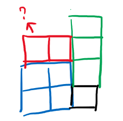
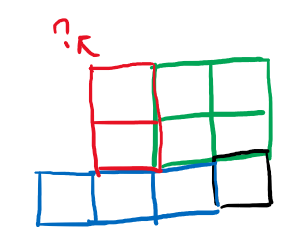
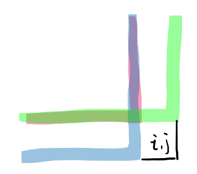

## 1. 动态规划

设 `dp[i][j]`代表以 `matrix[i][j]`为右下角的最大正方形的边长。
当 `matrix[i][j] == 0`时，`dp[i][j] = 0`.
当 `matrix[i][j] == 1`时，`dp[i][j] = min(dp[i-1][j-1], dp[i][j-1], dp[i-1][j]) + 1`.
如果越界，则上述min取0.

`matrix[i][j] == 1`的状态转移方程如上是因为：

1. 假如 `dp[i][j]`根据 `dp[i-1][j-1]`来求，则需要判断i行j列的连续的1最多有多少，然后取 `min(dp[i-1][j-1], i行的1, j列的1)`再加上1就是 `dp[i][j]`。
2. 假如 `dp[i][j]`根据 `dp[i][j-1]`来求，则需要判断j列的连续的1最多有多少，如果j列的小，则 `dp[i][j] = j列 + 1`，而如果j列的大，还需要判断 `i-dp[i][j-1]`行有没有足够的1使得可以形成 `dp[i][j] = dp[i][j-1] + 1`。
3. 假如 `dp[i][j]`根据 `dp[i-1][j]`来求，则需要判断i行的连续的1最多有多少，如果i行的小，则 `dp[i][j] = i行 + 1`，而如果i行的大，还需要判断 `j-dp[i][j-1]`列有没有足够的1使得可以形成 `dp[i][j] = dp[i-1][j] + 1`。
   

如果按照上面三种之一的求法，需要在遍历到每个点的时候，最多还要判断 `O(min(m, n))`次，因此时间复杂度是 `O(mn*min(m, n))`。
而我们可以发现，1需要的i行j列的连续的1的个数在 `dp[i][j-1]`和 `dp[i-1][j]`中分别有表示，2需要的j列的连续的1在 `dp[i-1][j]`中有所表示，需要的 `i-dp[i][j-1]`行的1的个数在 `dp[i-1][j-1]`和 `dp[i][j-1]`中有所表示。

所以我们发现，可以取 `min(dp[i-1][j-1], dp[i][j-1], dp[i-1][j]) + 1`作为 `dp[i][j]`，因为三者中最小的正方形要形成+1大的正方形需要的部分是另外两个较大的正方形可以提供的。


由上述状态转移方程可以得到时间复杂度 `O(mn)`，空间复杂度 `O(mn)`。
不过该空间复杂度可以优化，因为 `dp[i][j]`的求解仅依赖于左上方三个部分的值，所以可以将 `O(mn)`的数组优化为 `O(n)`的数组，只保留一行，空间复杂度就变成了 `O(n)`。

```cpp
class Solution {
public:
    int maximalSquare(vector<vector<char>>& matrix) {
        int m = matrix.size();
        if (m == 0)
            return 0;
        int n = matrix[0].size();

        vector<int> dp(n, 0);
        int mi[3] = {-1, 0, -1};
        int mj[3] = {-1, -1, 0};
        int ans = 0;

        for (int i = 0; i < m; i++) {
            int upperLeft = INT32_MAX;
            for (int j = 0; j < n; j++) {
                if (matrix[i][j] == '0') {
                    upperLeft = dp[j];
                    dp[j] = 0;
                    continue;
                }

                int limit = INT32_MAX;
                for (int k = 0; k < 3; k++) {
                    int curi = i + mi[k], curj = j + mj[k];
                    if (curi >= 0 && curi < m && curj >= 0 && curj < n) {
                        if (mi[k] == -1 && mj[k] == -1)
                            limit = min(limit, upperLeft);
                        else 
                            limit = min(limit, dp[curj]);
                    } else {
                        limit = 0;
                        break;
                    }
                }
                if (limit == INT32_MAX)
                    limit = 0;
              
                upperLeft = dp[j];
                dp[j] = limit + 1;
                ans = max(ans, dp[j]);
            }
        }

        return ans * ans;
    }
};
```
