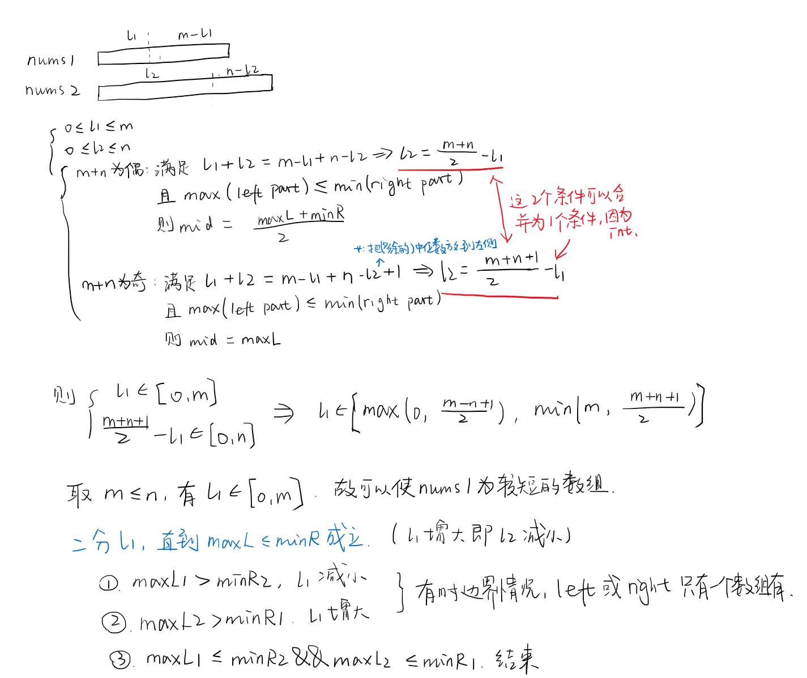

There are two sorted arrays nums1 and nums2 of size m and n respectively.

Find the median of the two sorted arrays. The overall run time complexity should be O(log (m+n)).

You may assume nums1 and nums2 cannot be both empty.

Example 1:

nums1 = [1, 3]
nums2 = [2]

The median is 2.0
Example 2:

nums1 = [1, 2]
nums2 = [3, 4]

The median is (2 + 3)/2 = 2.5

来源：力扣（LeetCode）
链接：https://leetcode-cn.com/problems/median-of-two-sorted-arrays
著作权归领扣网络所有。商业转载请联系官方授权，非商业转载请注明出处。

---

## 框架

```cpp
class Solution {
public:
    double findMedianSortedArrays(vector<int>& nums1, vector<int>& nums2) {
      
    }
};
```

## 1. 二分

题目没有明说，但是两个有序数组都是非降序的。
题目要求复杂度 `O(log(m+n))`，所以连接后排序 `O(nlogn)`，遍历 `O(n)`都不行了。对数复杂度一般是二分法。
但是需要确定二分的内容是什么。
遍历肯定是不可以的了，所以需要在一个非全体有序的条件下找到中间的部分。
因此可以想象把大数组分成两部分，选取中间的数据，左右两边的数据只需要分别取最大值和最小值就可以了，不需要非得是有序。
所以慢慢可以想到，应该是二分两个数组左右部分的长度，也就是把每个数组都分为左右两部分。
通过推导公式，得知可以把所有的长度都利用 `l1`表示。
然后发现最终结果的表示需要根据新的大数组的长度的奇偶性确定，所以分类讨论最终结果的表示方法。



需要注意的是 `l1, l2`表示的是长度，用作索引的时候需要注意-1+1。
测试的时候得到一个bug，问题是不能把 `return`写到 `if-else`条件中，即便最后必然执行 `else`中的 `return`，但是只要有一个 `if`条件中没有 `return`，编译就会报错。（依赖于编译器）
第一次提交失败，错误样例是 `nums1 = [], nums2 = [1]`。题目只说cannot be *both* empty，没说cannot be empty...

```cpp
class Solution {
public:
    double findMedianSortedArrays(vector<int>& nums1, vector<int>& nums2) {
        int m = nums1.size();
        int n = nums2.size();
        if (m > n) {         // set nums1 shorter
            auto temp = nums1;
            nums1 = nums2;
            nums2 = temp;
            auto tempi = m;
            m = n;
            n = tempi;
        }
        int left = 0, right = m;

        // l1 & l2 are the lengths, not indices
        int l1 = (left + right) / 2;
        int l2 = (m + n + 1) / 2 - l1;
        while (left <= right) {
            // l1 l2 的边界条件是为了后面nums的-1不越界，而不会造成其他影响
            if (l1 > 0 && l2 < n && nums1[l1 - 1] > nums2[l2])
                right = l1 - 1;
            else if (l1 < m && l2 > 0 && nums2[l2 - 1] > nums1[l1])
                left = l1 + 1;
            else
                break;
          
            l1 = (left + right) / 2;
            l2 = (m + n + 1) / 2 - l1;
        }

        int maxL;
        if (l1 == 0)
            maxL = nums2[l2 - 1];
        else if (l2 == 0)
            maxL = nums1[l1 - 1];
        else
            maxL = max(nums1[l1 - 1], nums2[l2 - 1]);
        if ((m + n) % 2 == 1)
            return maxL;    //fix empty bug
      
        int minR;
        if (l1 == m)
            minR = nums2[l2];
        else if (l2 == n)
            minR = nums1[l1];
        else
            minR = min(nums1[l1], nums2[l2]);
        return (maxL + minR) / 2.0;
    }
};
```
