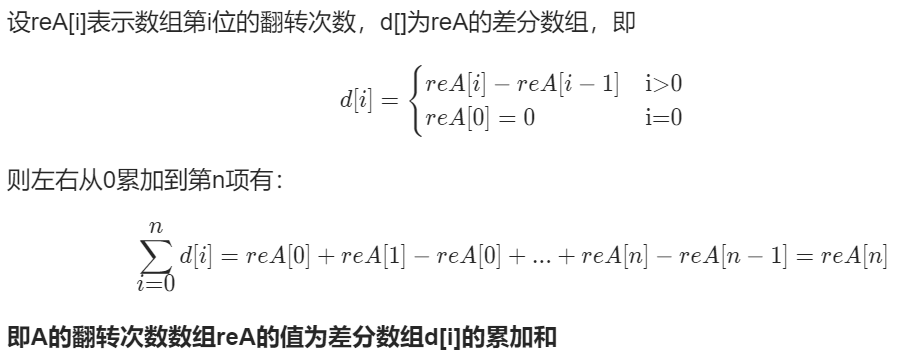

## 1. 贪心

贪心第一个0作为开始，将其及之后的元素进行反转。
因为如果反转的起点不是第一个0，则左侧的部分1也会被反转成0，而要反转被反转成的这部分0，又要向左延伸，因此需要贪心第一个0作为反转的起点。
时间 `O(nk)`，空间 `O(1)`，超时。

```cpp
class Solution {
public:
    int minKBitFlips(vector<int>& A, int K) {
        int n = A.size();
        int res = 0;

        for (int i = 0; i < n; i++) {
            if (A[i] == 0) {
                if (i <= n - K) {
                    for (int j = i; j < i + K; j++)
                        A[j] ^= 1;
                    res++;
                } else {
                    res = -1;
                    break;
                }
            }
        }

        return res;
    }
};
```

## 2. 差分数组

方法1中超时是因为及时反转了数组，有 `O(k)`的复杂度，因此考虑延迟反转数组。
如果使用一个数组直接记录每个元素的反转次数，则时间复杂度跟方法1中是相同的，而且还额外使用 `O(n)`的空间复杂度。
而我们又需要区间内每个元素的反转次数，因此考虑使用差分，其是利用对区间两侧的操作代替对区间内部的操作。

差分数组 `diff[i]`记录的是第i项的反转次数与第i-1项的反转次数之差，因此反转区间[i, i + K)只需要修改 `diff[i]++`和 `diff[i+K]--`即可，省去了修改中间的部分，从而降低了时间复杂度。（实际上也不需要修改 `diff[i]++`，因为只需要修改 `revCnt`即可，之后 `diff[i]`就没用了。）

那么如何利用差分数组 `diff`获得元素 `A[i]`的反转次数呢？
实际上根据差分数组的定义，有如下式子：
`revA[i] = revA[0] + (revA[1] - revA[0]) + ... + (revA[i] - revA[i - 1]) = diff[0] + diff[1] + ... + diff[i]`
也实际上就是 `A[i]`的反转次数 = `A[i-1]`的反转次数 + `diff[i]`。
因此只需要使用一个变量 `revCnt`记录总和，作为反转次数即可。
时间 `O(n)`，空间 `O(n)`。

```cpp
class Solution {
public:
    int minKBitFlips(vector<int>& A, int K) {
        int n = A.size();
        vector<int> diff(n, 0);
        int revCnt = 0, res = 0;

        for (int i = 0; i < n; i++) {
            revCnt += diff[i];      // 首先得到当前元素的反转次数
            if ((A[i] + revCnt) % 2 == 0) {     // 0且反转偶数次 或 1且反转奇数次 则需要修改
                if (i + K > n) {       // 进行越界检查
                    res = -1;
                    break;
                } else if (i + K < n)
                    diff[i + K]--;
                revCnt++;
                res++;
            }
        }

        return res;
    }
};
```

## 3. 滑动窗口

观察方法2中的 `diff`数组可以发现，`diff[i]`最多只会被修改--1次，代表 `A[i]`比 `A[i-1]`少反转1次。
所以如果将 `diff`数组的作用添加到原数组 `A`上，在原数组的基础上做标记，则可以省掉 `O(n)`的空间。
并且由于原数组中只有0和1，故将其修改为其他值，就代表该位置的 `diff`数组被修改了，该位置的反转次数要比前一个位置的反转次数少1次。
当然，如果需要保留原数组的数据，则可以不直接修改为其他值，而是在原来值的基础上添加其他值，比如+2，则大小超过1就代表修改过了，并且之后还原时，将大于1的数-2即可。
时间 `O(n)`，空间 `O(1)`。

```cpp
class Solution {
public:
    int minKBitFlips(vector<int>& A, int K) {
        int n = A.size();
        int revCnt = 0, res = 0;

        for (int i = 0; i < n; i++) {
            if (A[i] > 1)
                revCnt--;
            if ((A[i] + revCnt) % 2 == 0) {
                if (i + K > n) {
                    res = -1;
                    break;
                } else if (i + K < n) 
                    A[i + K] += 2;
                revCnt++;
                res++;
            }
        }
        for (int i = 0; i < n; i++)
            if (A[i] > 1)
                A[i] -= 2;

        return res;
    }
};
```
