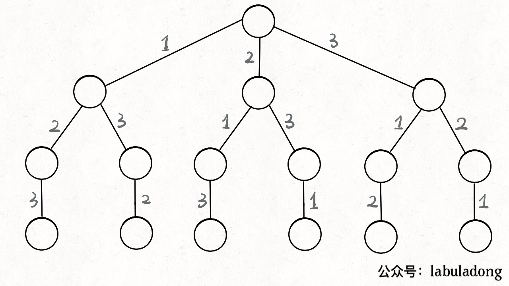

## 1. 递归+回溯


因为回溯是可以画出一棵回溯树的，所以光第一层调用dfs就要n次，而每次dfs还要层层深入，所以复杂度是很高的。
leetcode官方题解上分析出（组合数的加法），时间复杂度是 `O(n*n!)`，空间复杂度由于结果数组，所以是 `O(n*n!)`，如果不考虑结果数组的话，则是 `O(n)`。

```cpp
class Solution {
public:
    vector<vector<int>> permute(vector<int>& nums) {
        int n = nums.size();
      
        vector<vector<int>> ans;
        vector<int> cur(n);
        vector<bool> visited(n) {false};

        dfs(nums, cur, ans, visited, 0);
        return ans;
    }

    void dfs(vector<int>& nums, vector<int>& cur, vector<vector<int>>& ans, vector<bool>& visited, int count) {
        if (count == nums.size()) {
            ans.push_back(cur);
            return;
        }
        for (int i = 0; i < nums.size(); i++) {
            if (!visited[i]) {
                cur[count] = nums[i];
                visited[i] = true;
                dfs(nums, cur, ans, visited, count + 1);
                visited[i] = false;
            }
        }
    }
};
```
