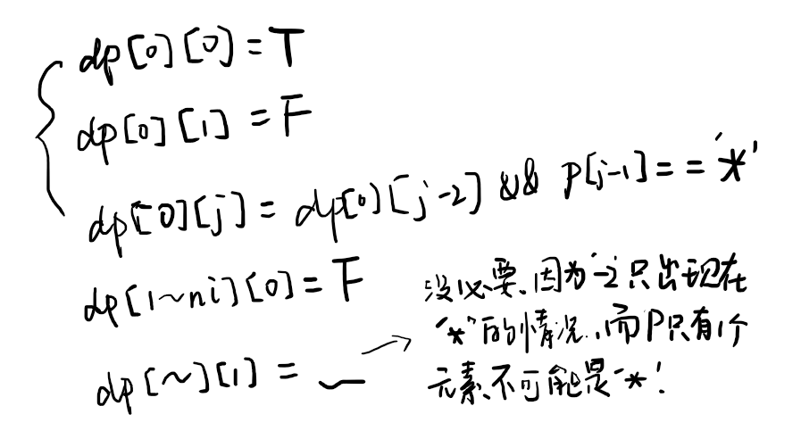

Given an input string (s) and a pattern (p), implement regular expression matching with support for '.' and '*'.

'.' Matches any single character.
'*' Matches zero or more of the preceding element.
The matching should cover the entire input string (not partial).

Note:

s could be empty and contains only lowercase letters a-z.
p could be empty and contains only lowercase letters a-z, and characters like . or *.
Example 1:

Input:
s = "aa"
p = "a"
Output: false
Explanation: "a" does not match the entire string "aa".
Example 2:

Input:
s = "aa"
p = "a*"
Output: true
Explanation: '*' means zero or more of the preceding element, 'a'. Therefore, by repeating 'a' once, it becomes "aa".
Example 3:

Input:
s = "ab"
p = ".*"
Output: true
Explanation: ".*" means "zero or more (*) of any character (.)".
Example 4:

Input:
s = "aab"
p = "c*a*b"
Output: true
Explanation: c can be repeated 0 times, a can be repeated 1 time. Therefore, it matches "aab".
Example 5:

Input:
s = "mississippi"
p = "mis*is*p*."
Output: false

来源：力扣（LeetCode）
链接：https://leetcode-cn.com/problems/regular-expression-matching
著作权归领扣网络所有。商业转载请联系官方授权，非商业转载请注明出处。

---

## 框架

```cpp
class Solution {
public:
    bool isMatch(string s, string p) {
      
    }
};
```

## 1. 直接遍历

`O(n)`
失败了……
本来觉得还算简单来着，但是这个 `*`着实气人，它想匹配多少就匹配多少，连 `a*a`都有。。
下面的代码是错的，没有考虑这种智障输入。

```cpp
class Solution {
public:
    bool isMatch(string s, string p) {
        int ni = s.size();
        int nj = p.size();
        int i = 0, j = 0;
        char pred = ' ';

        while(i < ni && j < nj){
            if (p[j] == '.') {
                if(p[j + 1] == '*'){ // ".*" matches everything
                    i = ni;
                    j++;
                }
                else
                    i++;
            }else if (p[j] == '*') {
                while(i < ni && s[i] == pred)
                    i++;
            }else{
                if (p[j + 1] == '*'){
                    while(i < ni && s[i] == p[j])
                        i++;
                    j++;
                }else{
                    if (s[i] == p[j])
                        i++;
                    else
                        return false;
                }
            }

            j++;
            pred = s[i - 1];
        }

        while(i == ni && j < nj){
            if (p[j] == '.') {
                if(p[j + 1] == '*')
                    j += 2;
                else
                    return false;
            }else if (p[j] == '*')
                j++;
            else
                return false;
        }

        if (i < ni)
            return false;
      
        return true;
    }
};
```

## 2. 动态规划

因为不能确定 `*`到底匹配多少个前一个字符，所以可以都测试一下。
设 `bool dp[i][j]`用来代表 `s`的前 `i`个字符和 `p`的前 `j`个字符的匹配关系，也就是 `s[0 ~ i-1]`和 `p[0 ~ j-1]`
那么 `dp[i][j]`就可以依靠前面 `dp[][]`的 `True/False`决定，表示后半部分匹配，结果由前半部分的匹配情况确定。

**以下讨论 `dp[i][j]`，即 `s[0 ~ i-1]`与 `p[0 ~ j-1]`的匹配情况。**

- **`s[i-1] == p[j-1]`**
  `dp[i][j] = dp[i-1][j-1]`说明 `p`中肯定是字母，并且二者在该位上匹配，所以 `s[0 ~ i-1], p[0 ~ j-1]`这部分是否匹配取决于 `dp[i-1][j-1]`。
- **`p[j-1] == '.'`**
  `dp[i][j] = dp[i-1][j-1]``.`可以匹配任何字母，因此二者在该位上也是匹配的，所以如上。
- **`p[j-1] == '*'`**
  `*`可以匹配0次或多(>0)次在 `*`左侧的那个字符。
  - **`s[i-1] != p[j-1-1] && p[j-1-1] != '.'`**`dp[i][j] = dp[i][j-2]`
    无法匹配，只能匹配0次。
  - **`else / s[i-1] == p[j-1-1] || p[j-1-1] == '.'`**
    可以匹配，可能匹配0次或多(>0)次。
    - **匹配0次**
      `dp[i][j] = dp[i][j-2]`即便 `s[i-1] == p[j-1-1]`也是有可能匹配0次的，比如 `s = abc, p = 'abcc*'`。匹配0次相当于这个字符和 `*`都不存在了，因此跳过这两个字符，如 `s = ab, p = abc*`
    - **匹配多(>0)次**
      `dp[i][j] = dp[i-1][j]`
      匹配 `k`次依赖于匹配 `k-1`次，后者又依赖于 `k-2`次，因此最终就变成了匹配0次，所以步骤就是依赖于 `dp[i-1][j]`
- **`else / s[i-1] != p[j-1] && p[j-1] != '.' && p[j-1] != '*'`**
  `dp[i][j] = false`
  不匹配。

初始化：


```cpp
class Solution {
public:
    bool isMatch(string s, string p) {
        int ns = s.size();
        int np = p.size();
        if(ns == 0){
            if(np % 2 == 0){
                for(int i = 1; i < np; i += 2)
                    if(p[i] != '*')
                        return false;
                return true;
            }else
                return false;
        }
        if(np == 0 && ns != 0)
            return false;

        bool **dp = new bool*[ns + 1];
        for(int i = 0; i <= ns; i++)
            dp[i] = new bool[np + 1];
      
        //initialization
        dp[0][0] = true;
        dp[0][1] = false;
        for(int i = 2; i <= np; i++)
            dp[0][i] = dp[0][i-2] && p[i-1] == '*';
        for(int i = 1; i <= ns; i++)
            dp[i][0] = false;

        //dp
        for(int i = 1; i <= ns; i++){
            for(int j = 1; j <= np; j++){
                if(s[i-1] == p[j-1] || p[j-1] == '.')
                    dp[i][j] = dp[i-1][j-1];
                else if(p[j-1] == '*'){
                    if(s[i-1] != p[j-2] && p[j-2] != '.')
                        dp[i][j] = dp[i][j-2];
                    else
                        dp[i][j] = dp[i][j-2] || dp[i-1][j];
                }else
                    dp[i][j] = false;
            }
        }

        bool ans = dp[ns][np];
        for(int i = 0; i < ns + 1; i++)
            delete []dp[i];
        delete []dp;

        return ans;
    }
};
```
