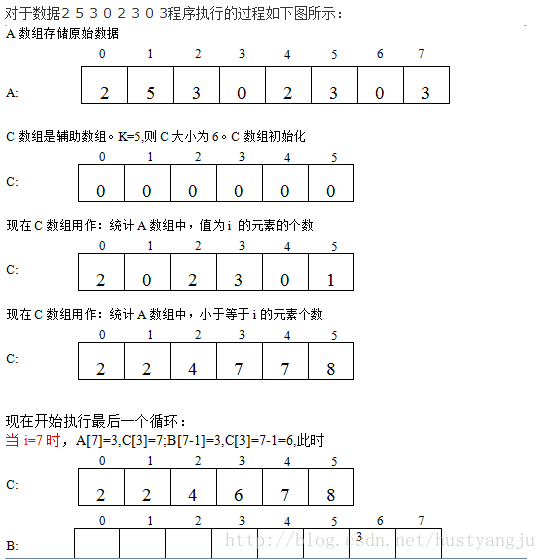
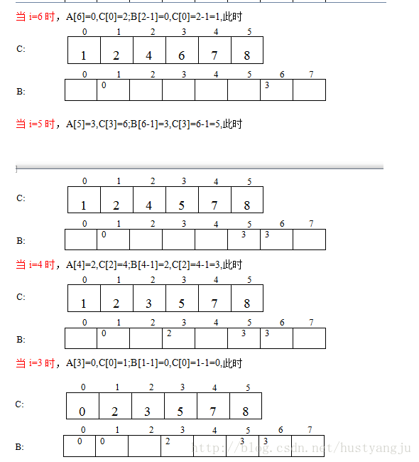
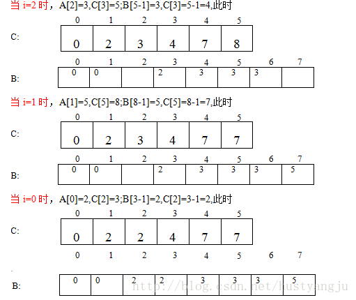

## 框架

以 leetcode [912. 排序数组](https://leetcode-cn.com/problems/sort-an-array/)为例。

```cpp
class Solution {
public:
    vector<int> sortArray(vector<int>& nums) {
      
    }
};
```

练习排序的题，要求复杂度 `O(nlogn)`。

## 1. 憨批解法之直接STL sort()

```cpp
class Solution {
public:
    vector<int> sortArray(vector<int>& nums) {
        sort(nums.begin(), nums.end());
        return nums;
    }
};
```

## 2. 计数排序counting sort

计数排序的时间复杂度是 `O(n+range)`的，空间复杂度是 `O(range)`。
由于计数排序不是比较排序，所以不受最优时间复杂度是 `O(nlogn)`的限制。
计数排序是稳定的排序方法，但是下面的代码不是稳定的。

```cpp
class Solution {
public:
    vector<int> sortArray(vector<int>& nums) {
        int *counter = new int[100010]{};   //需要加{}进行初始化
        for (int i = 0; i < nums.size(); i++)
            counter[nums[i] + 50000]++;
      
        int k = 0;
        for (int i = 0; i <= 100000; i++) {
            if (counter[i] != 0) {
                for (int j = counter[i]; j > 0; j--)
                    nums[k++] = i - 50000;
            }
        }

        delete []counter;
        return nums;
    }
};
```

稳定的计数排序如下所示，A是待排数组，B是排序之后的数组，k是范围：大致流程是：

1. `C[i]`首先记录 `i`的出现次数，遍历数组 `A`。
2. `C[i]`之后作为记录小于等于 `i`的元素的出现次数，即 `C[i] = C[i] + C[i - 1]`。
3. 从数组 `A`的最后一个元素开始，倒着向前遍历 `A[i]`。
   - 检查 `C[A[i]]`获得元素 `A[i]`的出现次数。
   - 由于 `A[i]`元素必存在，且通过 `C[A[i]]`获得了小于等于 `A[i]`的元素的个数，因此 `A[i]`在有序数组 `B`中的位置最大为 `C[A[i]] - 1`。
   - `B[C[A[i]] - 1] = A[i]`，然后 `C[A[i]]--; i--;`.
   - 逆序遍历完 `A`数组之后，`C[i]`就变成了小于i的元素的个数，`B`为有序的新数组。
4. 以上方法就相当于倒着每次把数组 `A`中最后的元素放到它可能在的最后的位置，从而保证了是稳定的。





同样，计数排序的空间复杂度也不一定必须是 `O(range)`的。
当 `range`很大而数据很少时，申请一个大空间是非常浪费的，因此可以申请一个大小为 `n`的空间作为 `counter`。
`counter[i]`不再是数据 `i`出现的次数，而是小于和在数据左侧等于 `nums[i]`这个数据的数据个数。
这样就直接获得了 `nums[i]`这个数据在有序数组中的位置，并且还保证了排序的稳定性。
获取 `counter`数组的时间复杂度为 `O(n^2)`。排序的空间复杂度为 `O(n)`。
.png)

## 3. 堆排序heap sort

时间复杂度 `O(nlogn)`，空间上可以原地排。不稳定的排序。

### 堆

由于堆是满二叉树，所以不需要定义节点的左右孩子，而直接通过索引运算就可以得到。
以下以最大堆为例。

#### 初始化 `heapify`

从最后一个有子节点的节点开始，判断以它为根的部分是否为满足要求的堆，若不满足，则下沉。
节点从最后一个开始，直到修改到根节点。由于修改之后以当前节点为根的堆就满足条件了，所以再修改之上的节点就下沉即可满足要求。
修改一个节点是 `O(logn)`，修改n个节点即为 `O(nlogn)`。但heapify的复杂度是并不是 `O(nlogn)`，而是 `O(n)`，这个可以通过数学推导得出。
当然，也可以最开始是一个空堆，然后插入n次，但这样的复杂度就是 `O(nlogn)`，比heapify要复杂。

```cpp
void heapify(vector<int>& nums)
{
    int n = nums.size();
    if (n == 1)
        return;
    for (int i = (n - 2) / 2; i >= 0; i--) {
        int loc = i;
        while (loc <= (n - 2) / 2) {
            int child = 2 * loc + 1;
            if (child + 1 < n && nums[child] < nums[child + 1])
                child++;
            if (nums[loc] < nums[child]) {
                int temp = nums[loc];
                nums[loc] = nums[child];
                nums[child] = temp;
                loc = child;
            } else
                break;
        }
    }
}
```

#### 插入 `push`

将节点添加到最后一个位置，然后判断是否需要对其进行上升操作。

```cpp
void push(vector<int>& nums, int value)
{
    nums.push_back(value);
    int n = nums.size();
    int child = n - 1;
    int parent = (n - 2) / 2;
    while (parent >= 0 && nums[child] > nums[parent]) {
        int temp = nums[parent];
        nums[parent] = nums[child];
        nums[child] = temp;
        child = parent;
        parent = (parent - 1) / 2;
    }
}
```

#### 删除 `pop`

删除堆的根节点，然后将最后一个节点移动到根节点，对新的根节点判断是否需要下降。
由于为了与题目对应，这里用vector作为存储工具，因为没有定义自己的size，所以用vector的resize()修改大小。

```cpp
int pop(vector<int>& nums)
{
    int n = nums.size();
    int value = nums[0];
    nums[0] = nums[n - 1];
    nums.resize(--n);
    int loc = 0;
    while (loc <= (n - 2) / 2) {
        int child = 2 * loc + 1;
        if (child + 1 < n && nums[child] < nums[child + 1])
            child++;
        if (nums[loc] < nums[child]) {
            int temp = nums[loc];
            nums[loc] = nums[child];
            nums[child] = temp;
            loc = child;
        } else 
            break;
    }

    return value;
}
```

如果想删除堆中任意位置的元素，则删除方法是用最后一个元素覆盖当前位置，size--，然后对当前位置元素进行上浮或下沉。

#### 堆排序

直接想到的方法是首先heapify建堆，然后每次弹出一个元素弹出到新的数组中。
不过堆排序是可以in-place修改的。
只需要把堆的根节点放到与数组最末尾的元素交换位置，然后size--不再考虑这个节点，就得到了一个最大值。这也是为什么从小到大排序需要大根堆的原因。
这样做就相当于是弹出了：离开了堆，且将最后一个元素换到了根节点位置上。

```cpp
class Solution {
public:
    void heapify(vector<int>& nums) {
        int n = nums.size();
        if (n == 1)
            return;
        for (int i = (n - 2) / 2; i >= 0; i--) {
            int loc = i;
            while (loc <= (n - 2) / 2) {
                int child = 2 * loc + 1;
                if (child + 1 < n && nums[child] < nums[child + 1])
                    child++;
                if (nums[loc] < nums[child]) {
                    int temp = nums[loc];
                    nums[loc] = nums[child];
                    nums[child] = temp;
                    loc = child;
                } else
                    break;
            }
        }
    }

    vector<int> sortArray(vector<int>& nums) {
        int n = nums.size();
        heapify(nums);
        int last = n - 1;

        while(last > 0) {
            int temp = nums[0];
            nums[0] = nums[last];
            nums[last--] = temp;
            int loc = 0;
            while (last > 0 && loc <= (last - 1) / 2) {
                int child = loc * 2 + 1;
                if (child + 1 <= last && nums[child] < nums[child + 1])
                    child++;
                if (nums[loc] < nums[child]) {
                    int ttemp = nums[loc];
                    nums[loc] = nums[child];
                    nums[child] = ttemp;
                    loc = child;
                } else
                    break;
            }
        }

        return nums;
    }
};
```

## 4. 选择排序selection sort

每次选最大的，交换到最后面。~~稳定排序~~，时间 `O(n^2)`，空间可原地排 `O(n)`。
选择排序是不稳定的，之前只考虑到了 `5,5,2,2`选择后面的 `5`与 `2`交换，却没想到后面的 `2`被换到了前面。

```cpp
class Solution {
public:
    vector<int> sortArray(vector<int>& nums) {
        int n = nums.size();
        for (int left = n; left > 1; left--) {
            int maxIndex = 0;
            // bool sorted = true;
            for (int i = 1; i < left; i++) {
                maxIndex = nums[i] >= nums[maxIndex] ? i : maxIndex;
                // if (maxIndex != i)
                //     sorted = false;
            }
            // if (sorted)
            //     return nums;
            swap(nums[maxIndex], nums[left - 1]);
        }

        return nums;
    }
};
```

及时终止的选择排序：当数据已有序时，上述代码仍需要每次遍历比较，浪费时间。
判断有序的条件就是，当在一次找最大值索引的过程中，该索引一直在变化，说明已有序。
代码以注释的形式添加进上述代码中。

## 5. 冒泡排序bubble sort

通过交换把最大值冒泡到最右侧。时间 `O(n^2)`，空间原地重排 `O(n)`，稳定排序。
缺点是需要大量的交换操作，最差需要 `O(n^2)`次（当序列为从大到小时）
及时终止的冒泡排序：当一次循环中一直没有交换，说明已有序。同样以注释方式展示。

```cpp
class Solution {
public:
    vector<int> sortArray(vector<int>& nums) {
        int n = nums.size();
        for (int left = n; left > 1; left--) {
            // int sorted = true;
            for (int i = 0; i < left - 1; i++) {
                if (nums[i] > nums[i + 1]) {
                    swap(nums[i], nums[i + 1]);
                    // sorted = false;
                }
            }
            // if (sorted)
            //     return nums;
        }

        return nums;
    }
};
```

## 6. 插入排序insertion sort

将右侧无序部分的最左侧的数据插入到左侧有序部分的对应位置，时间 `O(n^2)`，空间原地重排 `O(n)`，稳定排序。
插入方法是左侧有序部分的右侧数据不断向右移动，直到找到数据应该在的位置，并且已为其空出位置。

```cpp
class Solution {
public:
    vector<int> sortArray(vector<int>& nums) {
        int n = nums.size();
        for (int i = 1; i < n; i++) {
            int value = nums[i];
            int loc = 0;
            for (int j = i - 1; j >= 0; j--) {
                if (nums[j] > value) {
                    nums[j + 1] = nums[j];
                    loc = j;
                } else {
                    loc = j + 1;
                    break;
                }
            }
            nums[loc] = value;
        }

        return nums;
    }
};
```

## 7. 归并排序merge sort

分治的思想，先拆分后合并。

时间[`O(nlogn)`](https://www.jianshu.com/p/dfcfe667687b)，空间 `O(n)`（借助辅助数组），稳定排序。
以下是递归实现，递归过程相当于排左半部分，排右半部分，然后将两部分合并。

```cpp
class Solution {
public:
    vector<int> sortArray(vector<int>& nums) {
        vector<int> temp(nums.size());
        mergeSort(nums, temp, 0, nums.size() - 1);
        return nums;
    }

private:
    void mergeSort(vector<int>& nums, vector<int>& temp, int left, int right) {
        if (left >= right)
            return;
        int mid = (left + right) / 2;
        mergeSort(nums, temp, left, mid);        // 排左半部分
        mergeSort(nums, temp, mid + 1, right);   // 排右半部分
        merge(nums, temp, left, mid, right);     // 合并有序的左右两部分
    }

    void merge(vector<int>& nums, vector<int>& temp, int left, int mid, int right) {
        if (nums[mid] <= nums[mid + 1])     // 已有序
            return;

        // 为了避免频繁的临时数组的构造和析构，使用一个大的临时数组记录排序过程得到的结果，最后赋给nums即可
        // 修改之后，时间和空间的提升还是很大的。
        // vector<int> leftSubArray(nums.begin() + left, nums.begin() + mid + 1);
        // vector<int> rightSubArray(nums.begin() + mid + 1, nums.begin() + right + 1);

        int i = left, j = mid + 1;
        for (int k = left; k <= right; k++) {
            if (i > mid)
                temp[k] = nums[j++];
            else if (j > right)
                temp[k] = nums[i++];
            else {
                if (nums[i] <= nums[j])
                    temp[k] = nums[i++];
                else
                    temp[k] = nums[j++];
            }
        }

        for (int k = left; k <= right; k++)
            nums[k] = temp[k];
    }
};
```

以下是迭代实现，迭代实现可以循环步长，1, 2, 4, 8, ...代表每次合并的子数组的大小。

```cpp
class Solution {
public:
    vector<int> sortArray(vector<int>& nums) {
        mergeSort(nums);
        return nums;
    }

private:
    void mergeSort(vector<int>& nums) {
        int n = nums.size();
        vector<int> temp(n);
      
        for (int i = 1; i < n; i *= 2) {			// 每次合并的两个子数组各自的大小
            for (int j = 0; j < n; j += 2 * i) {	// 每一组要两两合并的子数组的索引
                int left = j, right = min(j + 2 * i - 1, n - 1);
                int mid = min(left + i, n - 1);
                int leftHead = left, rightHead = mid;
              
                int k = left;
                while (leftHead < mid || rightHead <= right) {
                    if (leftHead >= mid)
                        temp[k++] = nums[rightHead++];
                    else if (rightHead > right)
                        temp[k++] = nums[leftHead++];
                    else {
                        if (nums[leftHead] <= nums[rightHead])
                            temp[k++] = nums[leftHead++];
                        else 
                            temp[k++] = nums[rightHead++];
                    }
                }
            }
            for (int j = 0; j < n; j++)
                nums[j] = temp[j];
        }
    }
};
```

## 8. 快速排序quick sort

快速排序是不稳定的排序算法，时间平均是 `O(nlongn)`，空间复杂度是 `O(n)`。

快速排序是交换排序，跟冒泡排序是一样的。而冒泡排序之所以时间是 `O(n^2)`，是因为冒泡排序的每一轮都只会set一个最大值；而快速排序的第i轮可以set `2^i`个 `pivot`，平均只需要logn轮即可完成。

快速排序使用分治的思想：

1. 在数组中选择一个基准值
2. 将小于基准值的元素放在基准值的左侧，大于基准值的元素放在基准值的右侧。（相等的可以放在任意一侧）
3. 对基准值左侧和右侧的部分分别进行上述操作。

因此快速排序的每一轮实际上就是将 `pivot`放在它该在的位置上的过程，因为左侧的值都小于等于它，右侧的值都大于等于它。

所以问题主要就是，如何选择基准值以及如何将小于和大于基准值的元素放在左右两侧。

- **基准值的选择**

  基准值可以随意选择，也可以指定是数组的第一个或者最后一个元素。

  如果选择的不是最后一个元素，可以将 `pivot`与最后一个元素交换，这样问题就全都是最后一个元素是 `pivot`的状态了。
- **如何将小于和大于基准值的数据分别放在基准值的左右两侧？**

  使用双指针，假设 `pivot`取的最后一个元素或者是被交换到了最后一个元素的位置。

  双指针 `i`和 `j`分别指向数组的开头 `0`和结尾 `n-1`，首先向右移动 `i`找到大于 `pivot`的第一个元素，然后右侧指针 `j`向左移动找到小于 `pivot`的第一个元素，交换二者的值，则实现了小值到右侧，大值到左侧的目的。

  然后 `i`和 `j`继续移动，寻找下一个大于和小于 `pivot`的元素，直到二者相遇。

  当二者相遇时，交换相遇点和 `pivot`的值，就成功将小于基准值的数据放在了左侧，大于的数据放在了右侧。原因是每次都是首先向右移动 `i`，所以相遇点一定是大于 `pivot`的元素，最后一次交换正好将大于基准值的元素移动到了最右侧，`pivot`移动到了中间位置。

  这也是要求每次首先移动 `i`的原因，否则如果首先移动的是 `j`，则相遇点是小于 `pivot`的元素，在与 `pivot`交换位置之后得到的就是 `小小小pivot大大大小`的序列了。

递归实现：快排将 `pivot`set到该在的位置，然后快排由 `pivot`分开的左侧和右侧部分。

```cpp
class Solution {
public:
    vector<int> sortArray(vector<int>& nums) {
        quickSort(nums, 0, nums.size() - 1);
        return nums;
    }

private:
    void quickSort(vector<int>& nums, int begin, int end) {
        if (begin >= end)		// 边界条件
            return;
      
        int pivot = end;		// 取最后一个元素作为pivot
        int i = begin, j = end;
      
        while (i <= j) {
            if (i == j) {		// i和j指针相遇
                swap(nums[i], nums[pivot]);
                pivot = i;
                break;
            }
            if (nums[i] <= nums[pivot])			// 首先从左侧找一个大于pivot的值
                i++;
            else if (nums[j] >= nums[pivot])	// 然后从右侧找一个小于pivot的值
                j--;
            else
                swap(nums[i], nums[j]);			// 二者都找到时交换位置
        }
      
        quickSort(nums, begin, pivot - 1);		// 这个时候pivot已经被set到它该在的位置了
        quickSort(nums, pivot + 1, end);		// 递归实现对左右两部分的快速排序
    }
};
```

非递归实现：使用栈记录待排数据的左右范围，每次从栈中获得范围后进行排序。

```cpp
class Solution {
public:
    vector<int> sortArray(vector<int>& nums) {
        quickSort(nums);
        return nums;
    }

private:
    void quickSort(vector<int>& nums) {
        int n = nums.size();
        if (n <= 1)
            return;
      
        stack<pair<int, int>> st;
        st.emplace(0, n - 1);
        while (!st.empty()) {
            pair<int, int> part = st.top();
            st.pop();
          
            int pivot = part.second;
            int i = part.first, j = pivot;
            while (i <= j) {
                if (i == j) {
                    swap(nums[i], nums[pivot]);
                    pivot = i;
                    break;
                }
                if (nums[i] <= nums[pivot])
                    i++;
                else if (nums[j] >= nums[pivot])
                    j--;
                else
                    swap(nums[i], nums[j]);
            }
          
            if (part.second > pivot + 1)
                st.emplace(pivot + 1, part.second);
            if (part.first < pivot - 1)
                st.emplace(part.first, pivot - 1);
        }
    }
};
```

## 9. 希尔排序shell sort

希尔排序是对直接插入排序的改进，相比于直接插入排序，希尔排序首先将元素分为若干组，对每组做插入排序，然后减少组的个数（增大组的容量），形成新的组，再在新的组中进行插入排序，直到整个待排数组成为一个组。

希尔排序是基于插入排序的以下两点性质而提出改进方法的：

- 插入排序在对几乎已经排好序的数据操作时，效率高，即可以达到线性排序的效率
- 但插入排序一般来说是低效的，因为插入排序每次只能将数据移动一位

希尔排序需要选择步长，代表当前分组个数，当步长为1时，即整个待排数组作为一个分组。排序的时间复杂度取决于步长的选择。

步长默认可以选择 `n/2`，然后每次步长修改为原来的 `1/2`。

希尔排序是不稳定的排序，因为在分组进行插入排序时，可能将后面的值插入到前面。

```cpp
class Solution {
public:
    vector<int> sortArray(vector<int>& nums) {
        shellSort(nums);
        return nums;
    }

private:
    void shellSort(vector<int>& nums) {
        int n = nums.size();
        for (int step = n / 2; step > 0; step /= 2) {		// 步长
            for (int i = 0; i < step; i++) {				// 组号
                for (int j = i + step; j < n; j += step) {	// 同组的各元素
                    int num = nums[j], loc = j;
                    while (loc - step >= 0 && num < nums[loc - step]) {
                        nums[loc] = nums[loc - step];
                        loc -= step;
                    }
                    nums[loc] = num;
                }
            }
        }
    }
};
```
