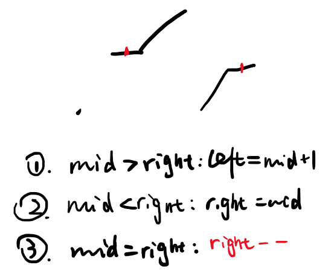

## 1. 朴素

直接遍历所有节点，获得最小值。
时间 `O(n)`，空间 `O(1)`。

## 2. 二分

如果数组中没有重复元素，则同[153. 寻找旋转排序数组中的最小值]。
此处存在重复元素，需要额外判断 `nums[mid] == nums[right]`的情况。
当二者相等时，实际上没法判断mid所处的位置，如下图：

所以一种方法是二分左半部分和右半部分，比较得到的最小值，可以通过递归实现。
另一种方法是中间值和右侧值相等时，`right--`，因为这样总不会错过正确答案。
时间 `O(logn)`，最差是 `O(n)`，因为受限于相等的值，可能需要搜索绝大部分甚至全部的值。

```cpp
class Solution {
public:
    int minArray(vector<int>& numbers) {
        int n = numbers.size();
        int l = 0, r = n - 1;
        while (l < r) {
            int mid = l + (r - l) / 2;
            if (numbers[mid] > numbers[r])
                l = mid + 1;
            else if (numbers[mid] < numbers[r])
                r = mid;
            else
                r--;
        }

        return numbers[l];
    }
};
```
