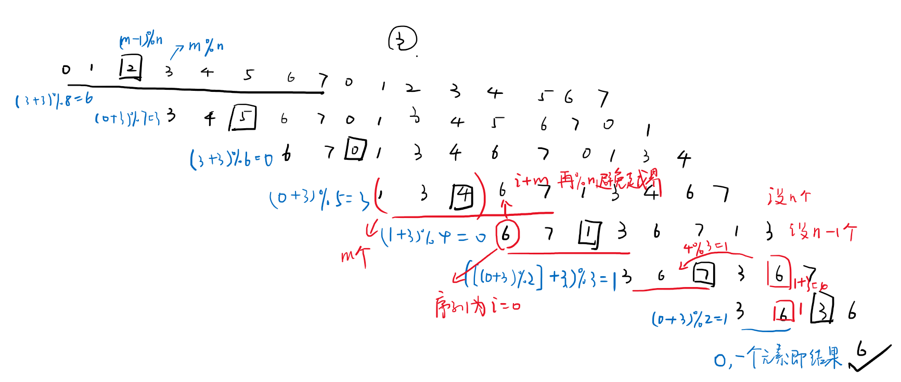

## 约瑟夫环

1. n个人编号0,1,2,...,n-1，每数m次删掉一个人
2. 假设有函数f(n)表示n个人最终剩下人的编号
3. n个人删掉1个人后可以看做n-1的状态，不过有自己的编号。
4. n个人删掉的第一个人的编号是(m-1)%n，那么n个人时删掉第一个人的后面那个人(m-1+1)%n一定是n-1个人时候编号为0的那个人，即n个人时的编号m%n（这个编号是对于n个人来考虑的）。
5. n-1个人时编号为i的人就是n个人时(m+i)%n
6. 所以f(n)=(m+f(n-1))%n
7. f(1)=0，因为1个人时只有一个编号0。
8. 从人数为1个时逆推即可。

作者：fu-sang-shu-xie
链接：https://leetcode-cn.com/problems/yuan-quan-zhong-zui-hou-sheng-xia-de-shu-zi-lcof/solution/li-jie-gui-lu-hen-jian-dan-javascriptjie-fa-by-fu-/
来源：力扣（LeetCode）
著作权归作者所有。商业转载请联系作者获得授权，非商业转载请注明出处。

---



```cpp
class Solution {
public:
    int lastRemaining(int n, int m) {
        int ans = 0;
        for (int i = 1; i < n; i++)
            ans = (ans + m) % (i + 1);
        return ans;
    }
};
```
